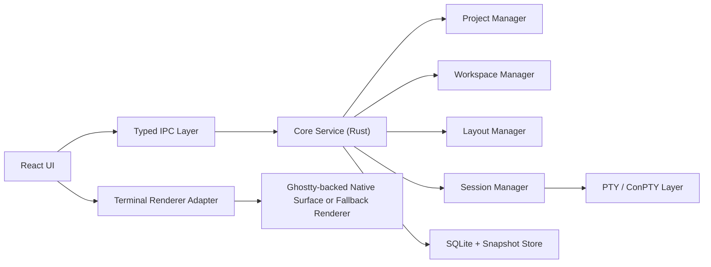

# System Architecture

## 1. 아키텍처 목표

새 아키텍처의 핵심은 "웹 UI를 사용하되, 시스템 책임은 네이티브 코어에 남긴다"는 것이다.

기존 DevHub의 문제는 다음과 같았다.

- 서버, 세션 관리, UI 이벤트, 제품 규칙이 한 파일에 집중됨
- 앱 내부 HTTP 서버가 사실상 내부 서비스 버스 역할까지 담당함
- 프로젝트/세션/Board/자동화 규칙이 강결합됨
- 특정 AI CLI 특화 로직이 런타임 중심부에 침투함

새 제품에서는 다음 원칙을 강제한다.

- UI는 레이아웃과 사용자 상호작용에 집중한다.
- PTY 세션과 프로세스 수명주기는 코어가 관리한다.
- 저장소는 UI state와 분리한다.
- 내부 통신은 typed IPC를 사용한다.
- 터미널 렌더러는 교체 가능해야 한다.

## 2. 권장 기술 선택

### 2.1 권장 스택

- Desktop shell: Tauri 2
- Core runtime: Rust
- UI: React + TypeScript + Vite
- State: Zustand
- Local DB: SQLite
- Layout UI: react-resizable-panels 기반의 커스텀 tree renderer
- Terminal renderer abstraction: adapter layer

### 2.2 이 스택을 권장하는 이유

- Tauri는 Electron보다 메모리 효율이 좋고 IPC 경계를 명확하게 설계하기 쉽다.
- Rust는 PTY, 프로세스 관리, 저장소, 이벤트 버스에 적합하다.
- React는 복잡한 pane tree와 상태 기반 렌더링에 유리하다.
- SQLite는 레이아웃과 프로젝트 메타데이터 저장에 충분하며 운영 복잡도가 낮다.

## 3. 런타임 구성

## 4. 모듈 경계

### 4.1 UI Layer

책임:

- 프로젝트 목록 렌더링
- 상단 탭바
- split-pane 레이아웃 편집
- 포커스와 단축키 처리
- command palette, context menu, settings 화면
- terminal view container 배치

비책임:

- PTY 생성
- 프로세스 종료 정책
- scrollback persistence
- 실제 세션 생존 여부 판단

### 4.2 Core Service Layer

책임:

- 프로젝트 CRUD
- 워크스페이스 로드/저장
- 세션 생성, 종료, 재연결
- 세션과 레이아웃의 연결 관리
- 상태 스냅샷 저장
- UI에 전달할 이벤트 발행

비책임:

- DOM 렌더링
- CSS 레이아웃 계산

### 4.3 PTY Layer

책임:

- ConPTY 세션 생성
- stdin/stdout/stderr 스트리밍
- resize
- shell, cwd, env 적용
- exit code 및 종료 이벤트 수집

비책임:

- 어떤 프로젝트에 속하는지에 대한 UI 표현
- 탭이나 pane 구조

### 4.4 Persistence Layer

책임:

- 프로젝트 목록 영속화
- 워크스페이스 구조 저장
- 탭 및 pane tree 스냅샷 저장
- 세션 선호 설정 저장

비책임:

- 실시간 PTY 출력 브로드캐스트

### 4.5 Renderer Adapter Layer

책임:

- UI가 만든 terminal host container에 렌더러를 붙인다.
- session output stream을 terminal view에 반영한다.
- resize/focus/destroy를 렌더러에 전달한다.

비책임:

- 세션 시작/종료
- 프로젝트 상태 관리

## 5. 내부 통신 방식

기본 원칙:

- 내부 런타임 통신은 HTTP가 아니라 IPC를 사용한다.
- UI와 코어는 명령/이벤트 계약을 공유한다.
- 브로드캐스트가 필요한 상태는 이벤트 스트림으로 보내고, 큰 상태는 쿼리 방식으로 당겨온다.

통신 유형:

- Command: 상태 변경 요청
- Query: 현재 상태 조회
- Event: 코어가 UI에 푸시하는 변화

예:

- Command: `workspace.createTab`
- Query: `workspace.getSnapshot`
- Event: `session.outputChunk`

## 6. 세션과 뷰의 분리

중요한 구조 규칙:

- `TerminalSession`은 프로세스와 PTY 리소스를 대표한다.
- `Pane`은 terminal session을 바라보는 뷰 슬롯이다.
- 하나의 session은 원칙적으로 한 번에 하나의 활성 view에 바인딩된다.
- pane을 닫는 것과 session을 종료하는 것은 별도의 액션이다.

이 분리를 명확히 해야 다음이 가능하다.

- pane 이동 후 session 유지
- stack 안에서 같은 session 재사용
- layout restore 시 session과 view 재결합

## 7. 왜 앱 내 웹서버를 기본 구조에서 제거하는가

새 제품에서는 기존 DevHub의 `Express + WebSocket + localhost` 구조를 기본 설계에서 채택하지 않는다.

이유:

- 앱 내부 제어용 통신에 네트워크 스택을 사용할 이유가 없다.
- 인증 없는 localhost API는 의도치 않은 노출면을 만든다.
- UI와 코어가 서로를 "외부 서비스"처럼 다루게 되어 설계가 흐려진다.
- 타입 안정성과 리팩터링 안정성이 떨어진다.

단, 미래에 다음이 필요해지면 별도 레이어로 추가할 수 있다.

- 플러그인 시스템
- 원격 제어
- 외부 자동화 API
- 멀티 디바이스 연동

## 8. 장애 격리 원칙

- UI 크래시가 세션 전체 종료로 이어지면 안 된다.
- renderer adapter 문제로 core session이 죽으면 안 된다.
- 하나의 session 크래시가 다른 프로젝트의 session에 영향을 주면 안 된다.
- persistence write 실패가 앱 전체 동작을 멈추게 하면 안 된다.

이를 위해 core는 최소한 다음 상태를 유지해야 한다.

- in-memory runtime registry
- durable snapshot store
- event replay 가능한 최소 메타데이터

## 9. 장기 확장성

이 구조는 후속 확장을 염두에 둔다.

- 멀티에이전트 오케스트레이션
- 원격 세션
- 세션 공유
- pane 내 custom panel
- AI provider adapter
- workspace automation

하지만 그 기능들은 `Project`, `Workspace`, `Tab`, `LayoutNode`, `TerminalSession` 구조 위에 올라가야 하며, 코어 모델을 다시 흔들지 않아야 한다.
