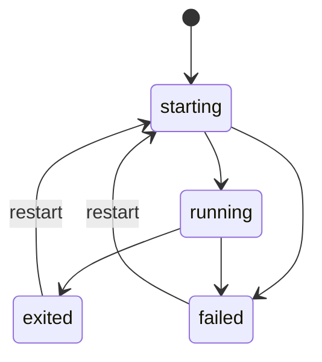

# Domain Model

## 1. 설계 원칙

도메인 모델은 "프로젝트 단위 작업 공간"을 중심으로 한다.

핵심 계층은 다음과 같다.

- Project
- Workspace
- WindowTab
- LayoutNode
- TerminalSession

이 모델은 UI 컴포넌트 구조가 아니라 제품의 논리 구조다.

## 2. 핵심 엔티티

### 2.1 Project

프로젝트는 사용자가 등록한 로컬 작업 디렉토리다.

필드:

- `id`
- `name`
- `path`
- `icon`
- `color`
- `tags`
- `lastOpenedAt`
- `createdAt`
- `archivedAt`

행동:

- 열기
- 이름 변경
- 정렬 순서 변경
- 보관
- 삭제

불변 규칙:

- `path`는 사용자 기준으로 식별 가능한 로컬 디렉토리여야 한다.
- 중복 path 등록은 허용하지 않는다.

### 2.2 Workspace

Workspace는 프로젝트에 연결된 사용자 작업 공간이다.

필드:

- `id`
- `projectId`
- `activeTabId`
- `tabOrder`
- `createdAt`
- `updatedAt`

행동:

- 탭 생성
- 탭 활성화
- 워크스페이스 스냅샷 저장
- 마지막 상태 복원

설명:

프로젝트와 워크스페이스는 1:1을 기본으로 한다. 추후 다중 workspace profile이 필요하면 확장 가능하지만 초기에는 프로젝트별 하나의 workspace가 가장 일관적이다.

### 2.3 WindowTab

상단 탭은 독립된 layout root를 가지는 작업 단위다.

필드:

- `id`
- `workspaceId`
- `title`
- `rootNodeId`
- `activePaneId`
- `createdAt`
- `updatedAt`

행동:

- split
- pane close
- stack item add/remove
- duplicate
- rename

### 2.4 LayoutNode

탭 내부의 공간 배치를 표현하는 트리 노드다.

종류:

- `split`
- `stack`

#### Split Node

- 방향: `horizontal | vertical`
- child node 배열
- split size 배열

#### Stack Node

- 여러 item을 같은 공간에 겹쳐 두고 탭처럼 전환
- `activeItemId`
- `items`

### 2.5 StackItem

stack 안에서 실제로 보이는 콘텐츠 단위다.

초기 종류:

- `terminal`

향후 확장 가능 종류:

- `inspector`
- `logs`
- `search`
- `agent-panel`

### 2.6 TerminalSession

실제 PTY 프로세스를 대표하는 런타임 엔티티다.

필드:

- `id`
- `projectId`
- `title`
- `shell`
- `cwd`
- `envProfileId`
- `status`
- `startedAt`
- `endedAt`
- `exitCode`
- `scrollbackRef`

상태:

- `starting`
- `running`
- `exited`
- `failed`

행동:

- start
- writeInput
- resize
- terminate
- restart

중요:

session은 레이아웃 노드 안에 직접 저장하지 않는다. 레이아웃은 `sessionId`만 참조한다.

### 2.7 ViewBinding

UI의 leaf 노드와 런타임 session을 연결하는 구조다.

필드:

- `paneId`
- `itemId`
- `sessionId`
- `attachedAt`

역할:

- 어떤 pane이 어떤 session을 표시하는지 추적
- restore 시 세션 재부착

## 3. 식별자 전략

- 모든 주요 엔티티는 UUID v7 또는 정렬 가능한 유사 ID를 사용한다.
- UI title과 내부 ID를 분리한다.
- 사용자 노출명은 언제든 바뀔 수 있어야 하며 내부 참조 키가 되어서는 안 된다.

## 4. 레이아웃 트리 모델

권장 타입:

```ts
type LayoutNode =
  | SplitNode
  | StackNode;

type SplitNode = {
  id: string;
  type: "split";
  direction: "horizontal" | "vertical";
  sizes: number[];
  children: LayoutNode[];
};

type StackNode = {
  id: string;
  type: "stack";
  activeItemId: string;
  items: StackItem[];
};

type StackItem = {
  id: string;
  kind: "terminal";
  sessionId: string;
  title: string;
};
```

규칙:

- split node는 최소 child 2개를 가진다.
- stack node는 최소 item 1개를 가진다.
- leaf는 별도 타입을 두지 않고 stack node로 통일한다.
- 단일 terminal만 있어도 stack node 하나로 표현한다.

이렇게 하면 모든 leaf를 같은 방식으로 다룰 수 있다.

## 5. 세션 라이프사이클



추가 규칙:

- session 생성 요청 후 UI는 낙관적으로 pane을 만들 수 있지만, 실제 상태는 `starting`으로 본다.
- PTY attach가 완료되기 전까지 입력은 queue 또는 차단 중 하나를 택해야 한다.
- session 종료 후에도 pane은 유지될 수 있다.

## 6. 프로젝트 전환 규칙

- 활성 프로젝트를 바꿔도 session은 종료하지 않는다.
- 비활성 프로젝트의 UI tree는 unmount될 수 있지만, workspace snapshot과 session registry는 유지된다.
- 재활성화 시 마지막 active tab과 focus pane을 복원한다.

## 7. 포커스 모델

포커스는 세 층으로 분리한다.

- 활성 프로젝트
- 활성 상단 탭
- 활성 pane 또는 stack item

추가로 실제 키보드 입력 포커스는 terminal renderer가 가진다.

## 8. 삭제와 종료의 차이

혼동을 막기 위해 액션을 분리한다.

- `Close Pane`: 뷰를 닫는다. session을 같이 종료할지 선택 규칙이 필요하다.
- `Close Tab`: 탭 레이아웃을 닫는다.
- `Kill Session`: 프로세스를 종료한다.
- `Remove Project`: 메타데이터를 제거한다.

권장 기본 동작:

- 마지막으로 session을 참조하는 pane을 닫을 때 사용자 설정에 따라 session 종료 여부를 결정한다.
- 기본값은 "세션도 함께 종료"가 자연스럽지만, 고급 설정으로 분리 가능하게 둔다.

## 9. 향후 확장 대비 필드

아직 구현하지 않아도 모델상 예약해둘 필드:

- `providerHint`
- `sessionRole`
- `workspaceProfileId`
- `terminalRendererKind`
- `sharedStateRef`

이 필드들은 나중에 AI, 원격 세션, 전용 패널이 들어올 때 모델 파괴를 줄여준다.
