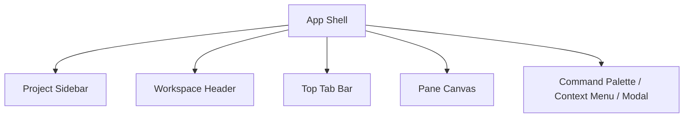

# UI and Workspace Layout

## 1. UI 목표

UI는 화려함보다 "문맥 유지"와 "빠른 조작"에 최적화해야 한다.

핵심 화면은 4영역이다.

- 좌측 프로젝트 사이드바
- 상단 워크스페이스 탭바
- 중앙 pane canvas
- 보조 패널 영역

## 2. 화면 구조

## 3. 좌측 프로젝트 사이드바

### 3.1 역할

- 등록된 프로젝트 목록 표시
- 최근 접근 순서 또는 사용자 고정 순서 지원
- 프로젝트 검색
- 프로젝트 상태 표시
- 새 프로젝트 추가

### 3.2 표시 요소

- 프로젝트 아이콘
- 이름
- 경로 축약 표시
- 최근 활동 시간
- 세션 수 또는 실행 중 표시
- 즐겨찾기 여부

### 3.3 상호작용

- 클릭: 프로젝트 활성화
- 우클릭: 이름 변경, 색상 변경, 보관, 삭제
- 드래그: 정렬 순서 변경
- 키보드 탐색 지원

## 4. 상단 워크스페이스 탭바

### 4.1 역할

- 현재 프로젝트 안의 상위 작업 컨텍스트를 나눈다.
- 예: `main`, `backend`, `ops`, `review`, `logs`

### 4.2 요구사항

- 탭 생성/닫기/이름 변경
- 탭 순서 변경
- 탭 복제
- 탭별 layout snapshot 유지
- 탭별 active pane 기억

### 4.3 탭과 pane 내부 stack의 차이

- 상단 탭은 "큰 작업 단위"를 나눈다.
- pane 내부 stack은 "같은 공간에서 번갈아 보는 세션 그룹"이다.

이 둘을 시각적으로 다르게 보여야 한다.

## 5. 중앙 Pane Canvas

### 5.1 역할

현재 탭의 layout tree를 렌더링한다.

### 5.2 지원 동작

- 좌우 split
- 상하 split
- pane 닫기
- pane swap
- split 비율 조정
- pane focus
- pane 내부 stack 전환

### 5.3 split 규칙

- split은 항상 현재 활성 pane 기준으로 수행한다.
- split 결과로 기존 pane은 유지되고, 새 pane이 생성된다.
- 새 pane에는 새 session 생성 또는 기존 session 연결 중 하나를 선택한다.

### 5.4 stack 규칙

- stack은 leaf pane 안에 여러 terminal item을 둘 수 있는 구조다.
- stack header에는 item title, session state, close 버튼이 있다.
- stack item을 드래그해서 다른 pane stack으로 옮길 수 있어야 한다.

## 6. 보조 패널

초기부터 우측 패널을 강제하지는 않지만, 구조상 확장 가능해야 한다.

예상 용도:

- session inspector
- cwd/env 정보
- quick actions
- search
- keymap help

초기에는 다음 최소 패널만 두는 것이 좋다.

- session info sheet
- settings modal
- project picker

## 7. Command Palette

제품의 편의성 핵심 중 하나다.

지원 항목:

- 프로젝트 검색/전환
- 새 탭
- split horizontal
- split vertical
- 새 세션
- 세션 재시작
- 세션 종료
- pane 이동
- 설정 열기

기본 단축키 예:

- `Ctrl+Shift+P`: command palette
- `Ctrl+T`: 새 탭
- `Ctrl+W`: 현재 탭 또는 stack item 닫기
- `Alt+Shift+H/V`: split
- `Ctrl+Tab`: 상단 탭 순환

## 8. 상태 표시 원칙

UI는 session 상태를 과장하지 않고 명확하게 보여야 한다.

표시 상태:

- running
- starting
- exited
- failed

시각 규칙:

- running: 강조 없는 활성 상태
- starting: subtle progress
- exited: muted
- failed: red accent

프로젝트 리스트에는 최소한 "해당 프로젝트에 살아 있는 세션 수"가 표시되어야 한다.

## 9. 빈 상태 설계

좋은 제품은 빈 상태가 중요하다.

### 9.1 프로젝트 없음

- 프로젝트 추가 버튼
- 드래그 앤 드롭으로 폴더 등록 안내
- 최근 디렉토리 열기

### 9.2 탭 없음

- 새 탭 생성
- 마지막 레이아웃 복원

### 9.3 pane에 session 없음

- 새 터미널 열기
- 최근 사용 세션 연결
- 기본 셸로 시작

## 10. 세션과 뷰 분리 UX

사용자는 뷰를 닫을 때 session이 사라지는지 항상 알 수 있어야 한다.

권장 UX:

- pane close 시 현재 stack item만 닫는다.
- session이 마지막 참조일 경우 confirm 옵션을 보여주거나 사용자 설정에 따라 자동 종료한다.
- 종료된 session은 stack item 안에 "Restart" 액션과 함께 남아 있을 수 있다.

## 11. 프로젝트 전환 UX

프로젝트 전환 시 다음이 중요하다.

- 마지막 active tab 복원
- 마지막 focus pane 복원
- 이전 프로젝트의 session 유지
- 전환 애니메이션은 최소화

프로젝트 전환은 페이지 이동이 아니라 workspace swap처럼 느껴져야 한다.

## 12. 레이아웃 저장 전략

저장은 다음 이벤트 후 debounce하여 수행한다.

- split 생성
- pane close
- stack item 이동
- split size 변경
- 탭 이름 변경
- active tab 변경
- active pane 변경

저장은 빠르되 과도한 디스크 쓰기를 피하기 위해 200~500ms debounce가 적절하다.

## 13. 접근성

- 키보드만으로 탭, pane, stack item 이동 가능
- screen reader용 기본 label 제공
- 색상 외에도 아이콘과 텍스트로 상태 표시
- 폰트 크기 확대 시 레이아웃 붕괴 방지

## 14. 디자인 원칙

- 메신저형 좌측 네비게이션
- code editor형 탭바
- terminal host 중심의 밀도 높은 중앙 캔버스
- 과한 장식보다 정보 구조 우선

추천 톤:

- dark-first지만 light theme도 지원
- 강한 대비와 낮은 시각 잡음
- 프로젝트, 탭, pane의 위계가 한눈에 보여야 함
