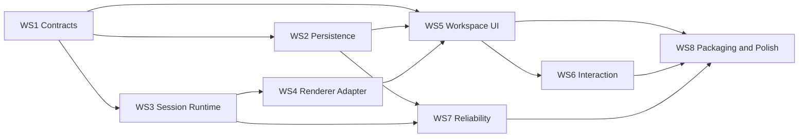

# Delivery Workstreams

## 1. 목적

이 문서는 제품을 "MVP 단계"로 쪼개기 위한 문서가 아니다. 완전한 제품을 구현하기 위해 어떤 작업 축을 어떤 순서와 완료 기준으로 진행할지 정의하는 실행 문서다.

핵심 원칙:

- 기능 목록이 아니라 구조 축으로 작업을 나눈다.
- 각 workstream은 다른 영역과의 계약을 먼저 고정한 뒤 구현한다.
- 한 축이 미완성인 상태로 다른 축을 임시 해킹으로 우회하지 않는다.

## 2. 전체 Workstream

### WS1. Contracts and Domain Foundation

범위:

- 도메인 타입 정의
- layout snapshot schema 정의
- IPC command/event type 정의
- session lifecycle state 정의

완료 기준:

- `Project`, `Workspace`, `WindowTab`, `LayoutNode`, `TerminalSession` 타입 확정
- UI와 core가 공유하는 contracts 패키지 생성
- layout validation 함수와 fixture 준비

### WS2. Persistence and Configuration

범위:

- SQLite 초기 스키마
- migration 체계
- settings storage
- workspace snapshot persistence

완료 기준:

- 프로젝트 CRUD가 DB에 영속화됨
- workspace/tabs/layout snapshot 저장/복원 가능
- schema migration 테스트 존재

### WS3. Session Runtime

범위:

- ConPTY wrapper
- session registry
- input/output stream 처리
- resize/terminate/restart

완료 기준:

- shell profile로 세션 생성 가능
- 입력/출력/종료 이벤트가 안정적으로 동작
- 여러 프로젝트에 걸쳐 세션이 독립적으로 살아 있음

### WS4. Terminal Renderer Adapter

범위:

- renderer adapter 계약 구현
- 개발용 fallback renderer 연결
- renderer attach/detach/rebind 처리

완료 기준:

- session output이 terminal view에 정상 렌더링
- pane 이동/복원 후 같은 session 재부착 가능
- resize와 focus가 일관되게 동작

### WS5. Workspace UI

범위:

- 프로젝트 사이드바
- 상단 탭바
- pane tree renderer
- stack UI

완료 기준:

- 프로젝트 전환
- 탭 생성/닫기/이름 변경
- pane split/close/focus
- stack item 전환

### WS6. User Interaction Layer

범위:

- command palette
- context menu
- drag and drop
- keyboard navigation

완료 기준:

- 마우스 없이 핵심 조작 가능
- 탭 재정렬, stack 이동 가능
- command palette에서 주요 액션 실행 가능

### WS7. Reliability and Diagnostics

범위:

- crash recovery
- snapshot recovery
- session error handling
- logs and diagnostics

완료 기준:

- 비정상 종료 후 workspace 복원 가능
- 손상된 snapshot fallback 동작
- session/renderer 오류 시 사용자 회복 경로 제공

### WS8. Packaging and Product Polish

범위:

- 앱 아이콘/메타데이터
- installer/portable packaging
- settings UI 정리
- empty state와 onboarding

완료 기준:

- 설치형과 portable 실행이 가능
- 신규 사용자 기준 첫 실행 경험 정리
- 기본 테마, 폰트, 단축키가 안정적

## 3. Workstream 선행 관계

## 4. 각 Workstream의 산출물

### WS1 산출물

- contracts 패키지
- domain schemas
- layout fixtures

### WS2 산출물

- SQLite migration 파일
- repository layer
- settings service

### WS3 산출물

- session manager
- PTY adapter
- session event stream

### WS4 산출물

- terminal renderer adapter 인터페이스
- fallback renderer 구현
- native renderer 실험 경계

### WS5 산출물

- project sidebar feature
- workspace shell
- tab bar
- pane tree renderer

### WS6 산출물

- command palette feature
- context menu system
- keybinding registry

### WS7 산출물

- diagnostics service
- recovery flows
- stability test cases

### WS8 산출물

- 패키징 설정
- 앱 메타데이터
- polishing checklist

## 5. 제품 완료 기준

제품은 아래 조건을 만족할 때 "완전한 제품 기준의 첫 출시 가능 상태"로 본다.

- 프로젝트 등록/삭제/전환이 안정적이다.
- 프로젝트별 workspace가 자동 복원된다.
- 상단 탭과 split-pane이 안정적으로 동작한다.
- 세션 생성, 출력, resize, 종료, 재시작이 안정적이다.
- 앱 재실행 후 snapshot이 정상 복원된다.
- fallback 또는 native renderer 중 제품 기준으로 채택한 렌더러가 일관되게 동작한다.
- 설정, 키바인딩, 폰트, 테마가 실제 사용 가능한 수준이다.
- 치명적 데이터 손상 없이 종료/복구 흐름이 검증되었다.

## 6. 구현 중 의사결정 규칙

구현 도중 선택지가 생기면 다음 순서로 판단한다.

1. 도메인 모델을 덜 훼손하는가
2. UI와 core 경계를 더 명확하게 유지하는가
3. renderer 교체 가능성을 보존하는가
4. session과 view를 분리하는 원칙을 지키는가
5. persistence migration을 단순하게 유지하는가

## 7. 문서 갱신 규칙

다음 변경이 생기면 이 문서를 갱신한다.

- 새로운 workstream 추가
- 완료 기준 변경
- 선행 관계 변경
- 제품 완료 정의 변경
